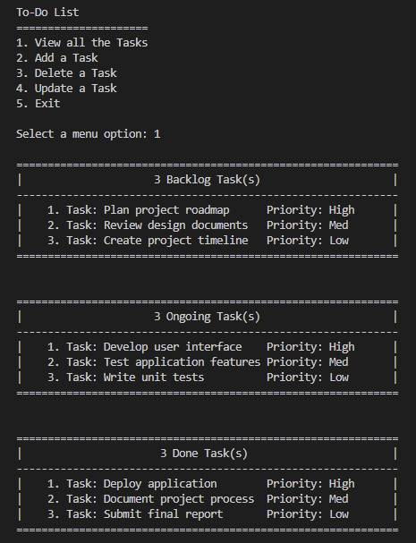

# Task 1: To-Do List Application

## Table of Contents

1. [Overview](#overview)
2. [Application Screenshot](#application-screenshot)
3. [Features](#features)
4. [Technologies Used](#technologies-used)
5. [Getting Started](#getting-started)
   - [Prerequisites](#prerequisites)
   - [Installation](#installation)
   - [Usage](#usage)
6. [Code Structure](#code-structure)
7. [Contact Information](#contact-information)

## Overview

Welcome to the repository for Task 1 of my CodSoft Python Programming Internship. This project focuses on developing a command-line To-Do List application using Python. The application allows users to manage and organize tasks efficiently by providing functionalities to add, update, delete, and view tasks. The task management system categorizes tasks into three main statuses: Backlog, Ongoing, and Done, and supports prioritization with levels Low, Med, and High.

## Application Screenshot

Here is a screenshot of the application:



## Features

- **Add a Task**: Allows users to add new tasks with a description, status, and priority level.
- **Update a Task**: Users can update the task's description, status, or priority.
- **Delete a Task**: Provides the ability to remove tasks from the list.
- **View All Tasks**: Displays all tasks grouped by their status in a formatted manner.
- **Data Persistence**: Tasks are saved to and loaded from a file to maintain state between sessions.

## Technologies Used

- **Programming Language**: Python 3.x
- **Libraries**: 
  - `os` (for file operations)

## Getting Started

### Prerequisites

Ensure you have Python 3.x installed on your system. You can download it from [python.org](https://www.python.org/downloads/).

### Installation

1. Clone this repository to your local machine:
   ```bash
   git clone [https://github.com/RiyaJ05/task_1_ToDoList.git](https://github.com/RiyaJ05/CodSoft_Internship_Task_1_ToDoList)

2. Navigate to the project directory:
   ```bash
   cd task_1_ToDoList

### Usage

1. Run the application:
   ```bash
   python main.py

2. Follow the menu options:
- **1**: View all the tasks.
- **2**: Add a new task.
- **3**: Delete an existing task.
- **4**: Update an existing task.
- **5**: Exit the appliaction.

### Data File
The application uses a file named Tasks.txt located in the same directory as the script for storing task data. This file is automatically loaded when the application starts and saved when the application exits.

## Code Structure
- **'Task' Class:** Defines the task with attributes for description, status, and priority. Provides methods for adding, updating, removing tasks, and displaying all tasks.
- **'menu' Function:** Displays the main menu of the application.
- **'load_list_from_file' Function:** Loads tasks from a file into the application.
- **'write_list_to_file' Function:** Saves tasks to a file.

## Contact Information
If you have any questions or feedback, feel free to reach out:

1. Email: riyajohari@gmail.com
2. LinkedIn: [Riya Johari](https://www.linkedin.com/in/riya-johari-547181259/)
3. GitHub: [RiyaJ05](https://github.com/RiyaJ05)
